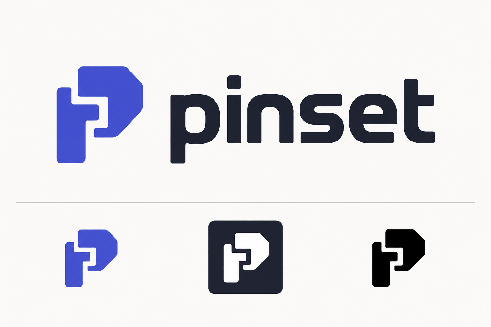

# Pinset

<p align="center">
  
</p>

[English](README.md) | [简体中文](README.zh-CN.md)

[](https://github.com/Future-Element/pinset/actions/workflows/ci.yml)
[](https://github.com/Future-Element/pinset/releases)
[](LICENSE)

Pinset is a predictable, project-boundary-aware runtime version manager for polyglot projects.

It manages Node.js, pnpm, Bun, Go, Python, Java, Rust, .NET, Flutter/Dart, and declarative development CLIs through one project configuration and one exact lockfile. Inside a project, commands such as `node`, `python`, `cargo`, `flutter`, and `jq` run directly through a lightweight shim. When the project is trusted, the same shim can inject the selected age-encrypted environment profile.

```text
pinset.toml  ──selection intent, project policy, environment profiles
     │
     ├── pinset.lock ──exact versions, platform artifacts, integrity metadata
     │
     └── Pinset shim ──direct command routing and policy-controlled environment injection
```

## Why Pinset

- **One project model**: use `pinset.toml` and `pinset.lock` across languages instead of stacking a separate version manager for every ecosystem.
- **Reproducible and explainable**: configuration retains selectors such as `lts`, `stable`, and version prefixes while the lock records exact versions. `current --explain`, `which --explain`, and `doctor` show how a result was chosen.
- **Direct project commands**: after one Shell setup, `node`, `pnpm`, `python`, `cargo`, and other commands route automatically without requiring `pinset exec` every time.
- **Strict project boundaries**: projects do not inherit global versions or silently fall back to system `PATH` unless policy explicitly permits it. Network installs and traditional version-file imports are also explicit.
- **Safe installation**: Providers verify integrity, extract safely, install atomically, and create ownership receipts used by audit, repair, uninstall, and prune operations.
- **Encrypted project environments**: every profile has its own age ciphertext and recipients. Private identities stay in the system keyring, a passphrase-protected recovery file, or a CI secret.
- **Automation-friendly**: stable JSON schema 1, reason codes, exit codes, Shell completions, offline lock auditing, and a GitHub Composite Action.

## Supported Providers

| Provider | Main commands | Windows x64 | Linux x64 | Linux ARM64 | macOS ARM64 |
| --- | --- | :---: | :---: | :---: | :---: |
| Node.js | `node`, `npm`, `npx`, `corepack` | ✓ | ✓ | ✓ | ✓ |
| pnpm | `pnpm` | ✓ | ✓ | ✓ | ✓ |
| Bun | `bun`, `bunx` | ✓ | ✓ | ✓ | ✓ |
| Go | `go`, `gofmt` | ✓ | ✓ | ✓ | ✓ |
| Python | `python`, `python3`, `pip`, `pip3` | ✓ | ✓ | ✓ | ✓ |
| Java (Temurin) | `java`, `javac`, `jar`, and JDK tools | ✓ | ✓ | ✓ | ✓ |
| Rust stable | `rustc`, `cargo`, `rustdoc`, `rustfmt`, Clippy | ✓ | ✓ | ✓ | ✓ |
| .NET SDK | `dotnet` | ✓ | ✓ | ✓ | ✓ |
| Flutter / bundled Dart | `flutter`, `dart` | ✓ | ✓ | — | ✓ |
| jq (declarative) | `jq` | ✓ | ✓ | ✓ | ✓ |

Flutter does not publish an official Linux ARM64 SDK archive compatible with the current installation model, so Pinset returns an explicit unsupported-target error instead of downloading an x64 artifact. External components such as Android SDK, Visual Studio Build Tools, and Windows SDK are diagnosed by `doctor` but are not installed by Pinset.

Default runtime resolution follows a language/project-official archive first policy. Node.js uses the nodejs.org `dist` archive, Go uses go.dev downloads, Python uses the python.org CPython archive, Flutter uses the official Google Storage release index, Rust uses static.rust-lang.org, .NET uses Microsoft release metadata, Java uses the Eclipse Temurin official release API, and pnpm/Bun use the standalone executable packages published by their projects in the official npm registry. After the user explicitly runs `source use` for an HTTPS mirror granted `--trust-metadata`, the order is “selected trusted source → official source → compatible distribution.” Other sources that were merely added are never contacted. `source fallback` adds only explicitly requested artifact-download retries and does not participate in metadata selection.

Python first uses python.org full ZIPs, MSI component archives, or historical monolithic MSIs, and falls back to `python-build-standalone` only when the official archive has no isolated artifact for the current target. Pinset downloads and verifies artifacts itself; it does not invoke uv, pyenv, nvm, or another runtime manager. Python 3.2 and earlier predate the standard-library `venv` module, so their managed interpreter can still be selected and executed directly, but Pinset cannot create a project virtual environment for them.

## How the installation layout works

Files such as `node.cmd`, `cargo.cmd`, and `flutter.cmd` in the command directory are tiny routers, not complete SDK installations. Actual runtimes remain isolated by Provider, version, and platform under `PINSET_HOME`:

```text
command directory/
├── pinset(.exe)           CLI
├── pinset-shim(.exe)      lightweight command router
├── node(.cmd)             routes to the selected Node.js runtime
├── cargo(.cmd)            routes to the selected Rust runtime
└── ...                    other built-in Provider commands

PINSET_HOME/
├── installs/
│   ├── node/<version>/<platform>/...
│   ├── rust/<version>/<platform>/...
│   └── flutter/<version>/<platform>/...
├── downloads/             content-addressed download cache
└── state/                 global selections, trust records, and local state
```

Having every routed command in one PATH directory is therefore intentional. The directory provides stable command discovery while the SDK payloads remain separate. Inspect the actual layout at any time:

```sh
pinset paths
pinset paths flutter
pinset list --long
pinset doctor --deep
pinset status --save diagnostic.json
pinset check --compare diagnostic.json
```

## Install

### Linux and macOS

The installer downloads the matching GitHub Release, verifies its `SHA256SUMS` entry, and installs into `~/.local/bin` by default:

```sh
curl -fsSL https://raw.githubusercontent.com/Future-Element/pinset/main/install.sh | sh
export PATH="$HOME/.local/bin:$PATH"
```

Install an exact version or choose another directory:

```sh
curl -fsSL https://raw.githubusercontent.com/Future-Element/pinset/main/install.sh | sh -s -- --version 2.12.3
PINSET_INSTALL_DIR=/opt/pinset/bin sh install.sh
```

### Windows PowerShell

```powershell
Invoke-WebRequest https://raw.githubusercontent.com/Future-Element/pinset/main/install.ps1 -OutFile install.ps1
.\install.ps1
Remove-Item .\install.ps1
```

Install an exact version:

```powershell
.\install.ps1 -Version 2.12.3
```

Windows and WSL are separate environments and require separate installations. The installer registers Pinset and every built-in command route, but it does not pre-download language runtimes.

Archives are also available from [GitHub Releases](https://github.com/Future-Element/pinset/releases), together with checksums, SBOMs, and build provenance.

## Shell setup

Pinset does not modify Shell profiles. Add the relevant command to your own profile so the Pinset routing directory precedes other runtime managers:

```sh
# Bash
eval "$(pinset activate bash)"

# Zsh
eval "$(pinset activate zsh)"
```

```fish
# Fish
pinset activate fish | source
```

```powershell
# PowerShell
pinset activate powershell | Out-String | Invoke-Expression
```

Generate completions when needed:

```sh
pinset completions bash
pinset completions zsh
pinset completions fish
```

```powershell
pinset completions powershell | Out-String | Invoke-Expression
```

## Quick start

### 1. Set global defaults

Global selections apply outside Pinset projects, or when a project explicitly inherits them:

```sh
pinset global node@lts pnpm@latest
pinset current node
```

### 2. Create a project and lock its runtimes

```sh
mkdir example && cd example
pinset init
pinset use node@24 pnpm@11 python@3.14 --no-install
pinset install --locked
pinset lock audit
```

Commit the generated `pinset.toml` and `pinset.lock`. After cloning, another developer only needs:

```sh
pinset install --locked
node --version
pnpm --version
python --version
```

`pinset.toml` stores selection intent, structured tool options, tasks, environment contracts, and policy; `pinset.lock` stores exact versions, options, and platform artifacts. Project configuration and the current runtime lock use schema 5. Older locks remain readable until an explicit migration. Encrypted environments do not participate in runtime artifact resolution.

### 3. Run another version temporarily

Without modifying project or global selections:

```sh
pinset x node@22 -- node --version
```

### 4. Import traditional version files

Pinset does not implicitly read `.nvmrc`, `.node-version`, `.tool-versions`, or similar files during normal resolution. Detect and import them explicitly during migration:

```sh
pinset detect --json
pinset import
```

`detect` is read-only and offline. `import` does not delete or modify its source files.

### 5. Save daily commands as tasks

Declare argument arrays instead of shell strings so Pinset preserves boundaries and child exit status:

```toml
[tasks.prepare]
command = ["pnpm", "install", "--frozen-lockfile"]

[tasks.dev]
command = ["pnpm", "dev"]
profile = "development"
description = "Start the development server"

[tasks.test]
command = ["pnpm", "test"]
cwd = "packages/app"
profile = "test"
depends-on = ["prepare"]
```

```sh
pinset run dev
pinset run test -- --watch
```

An explicit `-e` profile wins over `PINSET_ENV_PROFILE`, the task profile, the machine-local selection, and the project default. An unknown task is an error and never runs a same-named system command.

## Project policy

Projects are strict by default: undeclared tools do not inherit global selections or silently use system commands. Change that behavior explicitly in `pinset.toml` when required:

```toml
schema = 5
project-id = "4c5652e4-0000-4000-8000-000000000000"

[policy]
inherit-global = false
system-fallback = false
boundary = "git"
verification-strength = "checksum"
minimum-release-age = "7d"

[tools]
node = "24"
pnpm = "11"
```

Verification strength is ordered as `checksum < signed-checksum < provenance`. Pinset fails closed when upstream evidence is weaker than project policy or when required release-time metadata is unavailable.

## Encrypted project environments

Pinset 2.0 manages a deliberately limited layer of project-scoped string environment variables. It is not a general Secrets Vault. Every profile is a separate age ciphertext with its own recipients.

### Initialize and run directly

```sh
pinset migrate
pinset env init --profile development --auto --recovery ~/pinset-development-recovery.age
pinset env set DATABASE_URL --profile development
pinset env list --profile development
pinset trust add

# The shim selects the runtime and injects the development profile
node app.js
```

Important rules:

- `env set` uses hidden input by default, keeping the value out of process arguments.
- `env list` prints names only; revealing one value requires an interactive `env reveal`.
- Without `auto-profile`, direct shims do not inject an environment automatically.
- `PINSET_ENV_PROFILE=ci` explicitly selects another profile.
- `PINSET_ENV_DISABLE=1` or `pinset exec --no-env` disables injection for one command.
- Process and encrypted variables with the same name fail by default; `process-wins` and `encrypted-wins` are explicit alternatives.
- Recipient, profile-path, automatic-profile, or collision-policy changes invalidate local trust. Ciphertext value changes do not.
- Pinset never scans `.env` automatically and does not create a temporary plaintext `.env`.

### Import an existing `.env`

If a project already uses `.env`, explicitly migrate its variables into an encrypted profile:

```sh
pinset env import --from .env --profile development
```

The portable subset supports empty values, comments, single or double quotes, and quoted multiline values. Matching names update the target profile. `export`, interpolation, command substitution, and Shell expressions are rejected. Pinset does not discover or delete the source file; after verifying the migration, the user remains responsible for removing or otherwise protecting the plaintext `.env`.

### Move to a new computer

After cloning the project, install its runtimes, import the recovery identity, and trust the project again:

```sh
pinset install --locked
pinset env identity import --from ~/pinset-development-recovery.age
pinset trust add
node app.js
```

Keep recovery files outside the repository and back them up securely. Linux or SSH environments without an available system keyring require an explicit passphrase-protected identity file; Pinset never falls back to a plaintext private identity.

### GitHub Actions

Store the age private identity as the repository secret `PINSET_IDENTITY`. The profile and `project-id` are not secret and may be committed in project configuration:

```yaml
jobs:
  test:
    runs-on: ubuntu-latest
    env:
      PINSET_IDENTITY: ${{ secrets.PINSET_IDENTITY }}
      PINSET_ENV_PROFILE: ci
    steps:
      - uses: actions/checkout@v4
      - uses: Future-Element/pinset@v2.12.3
        with:
          version: 2.12.3
          install: "true"
          cache: "true"
          trust-project-id: "4c5652e4-0000-4000-8000-000000000000"
      - run: pinset exec -- node app.js
```

Identity-selection variables are removed before the business process starts. Do not inject server secrets into Flutter, Web, or other builds that compile environment values into client artifacts.

## Diagnose, repair, and update

```sh
# Explain final selection and real paths
pinset current --explain
pinset which node --explain
pinset paths node
pinset doctor --deep
pinset check --repair-preview

# Check locks, cache bytes, and installation ownership
pinset lock audit --json
pinset cache verify
pinset cache prefetch --jobs 4
pinset bundle export --output project.pinset-bundle.tar.gz
pinset bundle import project.pinset-bundle.tar.gz
pinset install --locked --offline

# Repair a damaged installation with a matching ownership receipt
pinset install node@24.0.0 --repair

# Self-update checks never run implicitly in the background
pinset self outdated
pinset self update

# Explicitly migrate an incompatible legacy global lock when needed
pinset migrate --global
```

`self outdated` and `self update` discover published versions through GitHub's public Release redirect or Atom feed without calling the rate-limited GitHub REST API. `self update` checks `PINSET_HOME/state/global.lock` before downloading and safely migrates known pre-1.0 records for Node.js, pnpm, Bun, Go, Python, Java, Rust, and .NET SDK at their existing exact versions. Flutter's target matrix is unchanged. Unknown or corrupted lock shapes are rejected instead of guessed.

`doctor --deep` and installation receipt checks validate layout, critical entries, and statistics. They do not claim cryptographic verification of every installed file.

## Security boundary

Pinset protects reproducible resolution, download integrity, repository-at-rest ciphertext, and the local trust boundary. It does not promise protection against administrators, debuggers, malicious project code, or a compromised CI environment. A process that receives a secret can start other programs, so Pinset does not present per-subcommand secret restrictions as an isolation boundary.

Version 2.0 intentionally excludes:

- AWS, Azure, or GCP KMS and OIDC-based dynamic key exchange;
- background daemons, tasks, hooks, and service management;
- arbitrary age plugins, arbitrary-code Providers, and general password-vault features;
- Nix/Conda-style dependency solving, remote secret sync, and dynamic secret leases;
- installation of external system components such as Android SDK, Visual Studio Build Tools, and Windows SDK.

## Command reference

For complete arguments, state changes, JSON support, exit codes, and common failures, see:

- [English command reference](docs/commands.md)
- [中文命令文档](docs/commands.zh-CN.md)

Or run:

```sh
pinset --help
pinset <command> --help
```

## Migration and upgrades

Preview an older project's migration to schema 5 before writing changes:

```sh
pinset migrate --dry-run
pinset migrate
```

Migration reports project configuration, runtime lock, and legacy installation receipts separately. It does not create encrypted environment files. The 2.0 release line contains only `2.0.0-rc.1` and `2.0.0` milestones.

## Uninstall

Check references and ownership before removing a runtime:

```sh
pinset uninstall node@24.0.0 --dry-run
pinset uninstall node@24.0.0
pinset prune --dry-run
```

To remove Pinset itself, delete the CLI, shim, and routes from the command directory, then remove the initialization line you added to the Shell profile. Delete `PINSET_HOME` only when you also intend to remove every managed runtime, cache entry, global selection, and local trust record. Project `pinset.toml`, `pinset.lock`, `pinset.env/*.age`, and `.venv` files are never removed automatically.

## Current release and roadmap

### v2.1: batch selection and installation

Pinset 2.1 lets `global` and `use` accept a variable-length `SELECTION...` list. A batch may contain any non-duplicate set of Pinset's built-in Providers whose declared dependencies are present in the resulting scope: Node.js, pnpm, Bun, Go, Python, Java, Rust, .NET, and Flutter. Dart continues to come from the selected Flutter SDK. The examples below are illustrative, not a fixed tool set:

```sh
pinset global node@lts python@latest rust@stable
pinset use java@lts dotnet@lts flutter@latest
pinset use --global node@lts pnpm@latest bun@latest go@latest python@3.14
```

- Public syntax is `pinset global [SELECTION...] [--no-install]` and `pinset use <SELECTION...> [--no-install] [--global]`. `global` keeps its no-argument inspection mode; `use` requires at least one selection. There is no fixed batch size.
- `--no-install` applies to the complete batch. Existing selections not named by the command remain unchanged.
- Every argument is parsed, duplicate Providers are rejected, and every selector is resolved before Pinset writes state. A parse, metadata, policy, or resolution failure leaves configuration, lockfiles, and installations unchanged.
- All resolved selections are committed under a cross-process state lock. Each file replacement is atomic, the complete resulting lock is validated before writing, and concurrent commands re-read state after acquiring the lock so unrelated selections are preserved. A process or machine failure between the two file replacements still fails closed and can be repaired by retrying the state command.
- After the state commit, Pinset performs one locked installation pass in Provider dependency order. Downloads are not run concurrently in v2.1, so output, shared dependencies, cache ownership, and failure recovery stay deterministic.
- If installation fails after the state commit, successfully installed runtimes remain valid and the complete requested state remains locked. The error directs the user to retry with `pinset install --locked` or `pinset install --global --locked`; Pinset does not pretend that already completed filesystem installations can be rolled back atomically.
- Help, completions, English/Chinese command references, and tests cover single-selection compatibility and multi-selection behavior. `install <tool@exact-version>` remains a single explicit-selection command; lock-based `install --locked` installs the complete scope.

### v2.2: shorter commands and local environments

Pinset **2.2.0** simplifies command execution and remembers this machine's project environment:

```sh
pinset env init
pinset env use dev
pinset env set DATABASE_URL
pinset -- pnpm dev
pinset -e test -- pnpm test
pinset -C ./another-project -- pnpm dev
pinset env reset
```

`env use` stores a machine-local preference per project/worktree without changing shared defaults; CI ignores it. `env share/unshare/members` simplify recipient management. Existing `exec`, trust requirements, and project/lock formats remain compatible. See the [command reference](docs/commands.md#short-execution-22) for selection precedence, noninteractive setup, and execution boundaries. Named tasks are not part of 2.2.

### v2.3: tasks and environment contracts

Pinset **2.3.0** stores repeatable project workflows and validates environment readiness:

```sh
pinset run dev
pinset run test -- --watch
pinset env check --profile test
pinset env diff development test
```

Schema 5 adds `[tasks.<name>]` and `[environment.variables.<name>]`. Tasks can declare an argument array, project-relative directory, profile, description, and `depends-on` list. Dependencies run once in declaration order before the selected task; cycles and missing dependencies are configuration errors, and the first nonzero exit stops the graph. Contracts support `string`, `integer`, `boolean`, `url`, and `enum`, required fields, profile filters, and defaults for non-secret values. Schema 4 projects remain readable and keep working until `pinset migrate` explicitly enables schema 5.

### Workspaces

Schema 5 can declare explicit projects that share root defaults while keeping a separate `pinset.toml` and `pinset.lock` for every member:

```toml
[workspace]
members = ["apps/web", "services/api"]

[tools]
node = "24"
```

```sh
pinset workspace members
pinset workspace install
pinset workspace check --changed-since origin/main
pinset workspace run test -- --watch
pinset workspace update
pinset workspace references node
```

A member selector replaces the root selector for that tool. Its complete `[tool-options.<tool>]` table also replaces the root table, so arrays never merge implicitly. Root tasks and environment defaults are inherited unless the member declares the same task or its own complete environment section. Batch update is a preview and does not modify member locks.

### Candidate upgrades and recovery

Prepare and test an exact candidate toolchain without changing the current project lock:

```sh
pinset candidate prepare
pinset candidate test test
pinset candidate apply
pinset candidate history
pinset candidate restore
pinset candidate recover
```

Add `--workspace` to `prepare`, `test`, `status`, or `apply` to process every explicit member. Candidate records bind the raw and effective configuration, current lock, project identity, task definitions, Git HEAD, and worktree cleanliness. Apply accepts only the exact lock from the latest passing test and refuses conflicting configuration, lock, or Git changes. Recovery covers Pinset-managed lock state; commands run during tests may still change application files or external systems.

### Declarative Providers

Registry schema 2 can install development CLIs distributed as platform binaries in GitHub Releases. A Provider declares a fixed repository, target-to-asset map, checksum asset, commands, and revision. Manifests cannot contain scripts, hooks, shell fragments, arbitrary URLs, or environment code. `jq` is the first Provider delivered through this generic backend:

```sh
pinset use jq@1.8
pinset -- jq --version
pinset provider status
pinset provider validate registry/providers.json
pinset provider scaffold jq --repository jqlang/jq --command jq
```

Pinset verifies the signed Registry, exact release asset URLs, upstream SHA-256 file, downloaded bytes, installation receipt, and active Provider revision before routing a command. `provider trust` activates a clear-signed snapshot from Pinset's pinned signer; `provider untrust` returns to the snapshot embedded in the binary. A signed revision can disable a Provider, and existing locks then fail closed.

### VS Code integration

The [Pinset VS Code extension](editors/vscode/README.md) is available from the [Visual Studio Marketplace](https://marketplace.visualstudio.com/items?itemName=FutureElement.pinset-vscode). It reads the versioned `pinset editor context --json` protocol and shows the Pinset CLI version, resolved toolchain versions, and selected environment in the status bar. Uninitialized folders receive a one-click `Pinset: Init` action. It also provides diagnostics, environment selection, declared tasks, and cancellable task terminals in single-root and multi-root workspaces:

```sh
code --install-extension FutureElement.pinset-vscode
pinset editor context --json
```

The extension starts no Pinset or project process until VS Code marks the workspace trusted. It checks the protocol and minimum extension version before using context, keeps each workspace folder's state separate, and terminates the launched process tree when a task terminal is cancelled.

## Contributing and license

Read [CONTRIBUTING.md](CONTRIBUTING.md) before submitting changes. Report security issues according to [SECURITY.md](SECURITY.md).

Pinset is licensed under the [MIT License](LICENSE).
